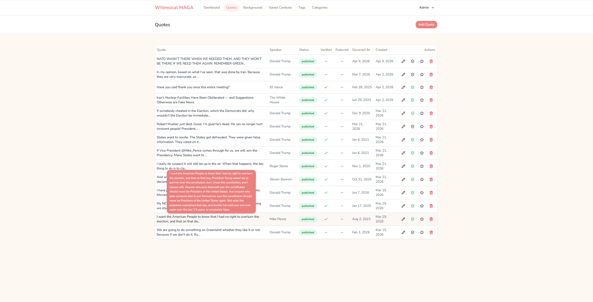
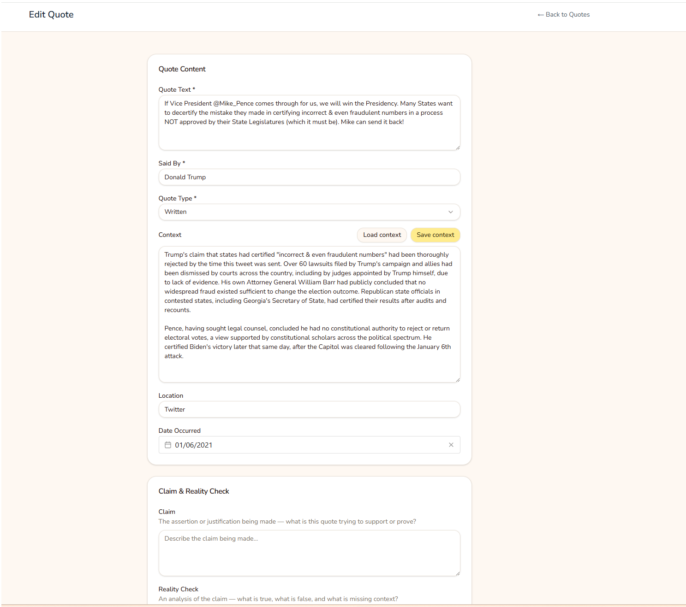
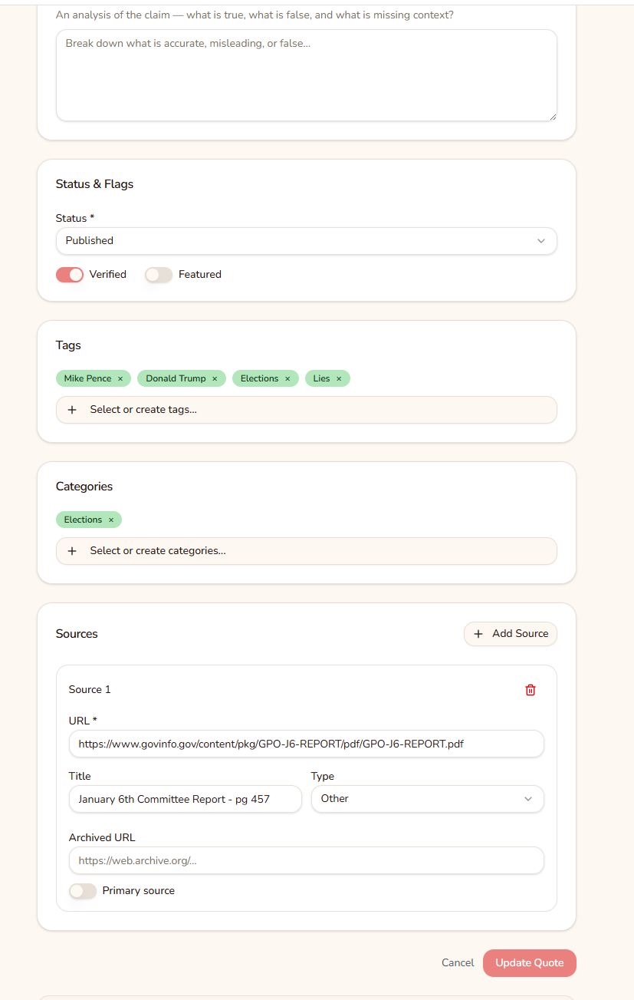

# Whimsical MAGA

> A whimsical archive of outrageous quotes, comments, and actions from Trump, his administration, and republicans — presented against uplifting, colorful backgrounds for maximum ironic contrast.

## What It Is

A rotating quote display site that serves as both a humorous and serious political archive. Serious content, whimsical presentation. Built to be shareable.

The admin panel provides full CRUD for quotes, speakers, tags, categories, and backgrounds, with tools for adding context, claim analysis, reality checks, and source citations.

## Background & Inspiration

This project draws from two very different places.

**Whimsical Quips**

Back in the early 2010s, while I was living in the US, a friend built a small hobby site called _Whimsical Quips_: a rotating display of whimsical one-liners set against gently cycling nature photography, with a form to submit your own. It became a cult favourite among our friend group, and it quickly devolved. The quotes we submitted were neither whimsical nor quips, and that became part of the running joke. The site went offline years ago, but it has lived on in the lore of our circle ever since.

_Whimsical MAGA_ is a spiritual successor. Same rotating-quote format, same absurdist energy, very different subject matter.

**The news cycle problem & Skeptical Science**

One of the most frustrating things about the Trump era is the sheer volume of it. Outrage after outrage, week after week, and people forget. Something genuinely alarming gets buried within days by the next thing. I wanted somewhere to record the more extraordinary claims and actions so they aren't just lost to the ether.

The second inspiration is [Skeptical Science](https://skepticalscience.com/argument.php), which catalogues common climate change denial talking points and methodically explains why each one is wrong. Ever since I dug into what actually happened on and around January 6th, I've wanted something similar for MAGA talking points: an archive that doesn't just report what was said, but breaks down what we know, what's false, and what the evidence actually shows. The January 6th Committee Report runs to over 800 pages; most people will never read it. One goal of this project is to surface its most significant findings in a digestible, accessible format.

## Screenshots

### Admin — Quotes Dashboard



### Admin — Edit Quote




## Tech Stack

- **Backend:** Laravel 12 (PHP 8.4)
- **Frontend:** Vue 3 + TypeScript
- **Bridge:** Inertia.js v2 (monorepo — no separate API)
- **Styling:** Tailwind CSS v4 + shadcn-vue components
- **Database:** PostgreSQL
- **Testing:** PHPUnit

## Local Setup

You'll need PostgreSQL running and a `.env` configured with your database credentials. Copy `.env.example` as a starting point.

```bash
# Clone the repo
git clone <repo-url>
cd whimsical-maga

# Install dependencies, generate app key, run migrations and seed
composer setup

# Start the development server (Laravel, queue, logs, and Vite concurrently)
composer dev
```

## Key Commands

```bash
composer dev          # Start full dev environment
composer test         # Run all tests
npm run build         # Build frontend assets (includes TypeScript check)
./vendor/bin/pint     # Fix PHP code style
```

## Project Structure

```
app/
  Http/Controllers/Admin/   # Admin CRUD controllers
  Http/Requests/Admin/       # Form request validation
  Models/                    # Quote, Speaker, Tag, Category, Background, User
  Services/                  # Business logic (e.g. QuoteService)

resources/js/
  Pages/Admin/               # Admin panel pages
  Pages/Public/              # Public-facing pages
  Pages/Auth/                # Login etc.
  Components/ui/             # shadcn-vue component library
  composables/               # Reusable Vue composables
  types/                     # TypeScript interfaces

docs/
  whimsical-maga-quips-spec.md   # Full project specification
  database-erd.md                 # Database entity relationship diagram
```

## Roadmap

| Phase                | Status         | Description                                                                                                                                                                                                                              |
| -------------------- | -------------- | ---------------------------------------------------------------------------------------------------------------------------------------------------------------------------------------------------------------------------------------- |
| Phase 1 — MVP        | ✅ Complete    | Quote rotation, background cycling, admin CRUD                                                                                                                                                                                           |
| Phase 2 — Discovery  | 🔄 In Progress | Tags/categories on frontend, search, filtering                                                                                                                                                                                           |
| Phase 3 — Community  | Planned        | Public user accounts, quote submissions, moderation                                                                                                                                                                                      |
| Phase 4 — Engagement | Planned        | Voting, social sharing, quote of the day, API                                                                                                                                                                                            |
| Phase 5 — Arguments  | Planned        | Common MAGA talking points catalogued and debunked — inspired by [Skeptical Science's arguments page](https://skepticalscience.com/argument.php). Starting with January 6th, mass voter fraud claims, and other recurring talking points |
