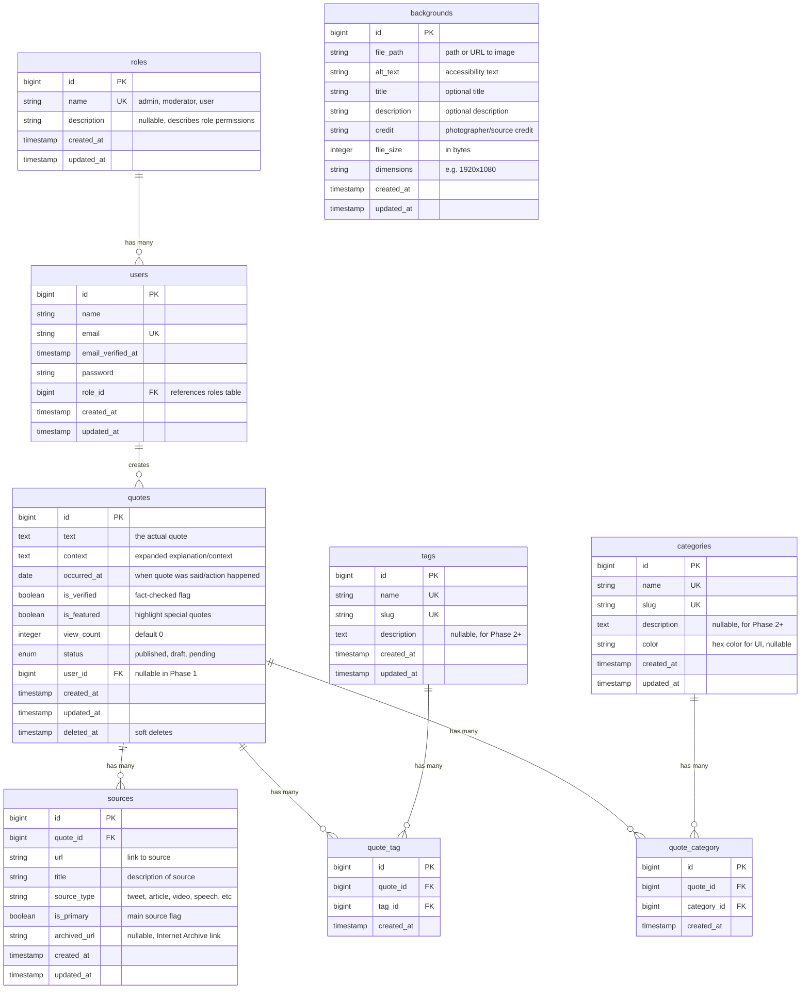

# Database ERD - Whimsical Trump Quips

This file contains the Mermaid syntax for the database Entity Relationship Diagram.
You can paste this into https://mermaid.live/ to view or export as PNG/SVG.

## Tables Summary

### Core Tables
- **roles**: User role definitions (admin, moderator, user)
- **users**: All users (admin and regular users in Phase 3+)
- **quotes**: The main content - Trump quotes/actions
- **sources**: Multiple sources per quote (URLs, citations)
- **backgrounds**: Whimsical background images (separate pool)
- **tags**: Many-to-many tagging system
- **categories**: Many-to-many categorization system

### Pivot Tables
- **quote_tag**: Links quotes to tags
- **quote_category**: Links quotes to categories

## Key Relationships
- One role has many users
- One user creates many quotes
- One quote has many sources
- Quotes and backgrounds are separate pools (no direct relationship - randomly paired)
- Quotes have many tags (via quote_tag pivot)
- Quotes have many categories (via quote_category pivot)

## Notes
- Using BIGINT auto-incrementing IDs (Laravel default)
- Soft deletes on quotes table (deleted_at)
- Status enum for quotes: published, draft, pending
- user_id is nullable in Phase 1 (admin-created quotes don't need user attribution initially)
